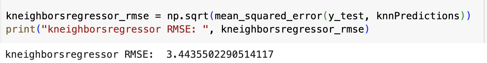
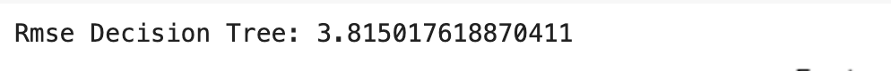
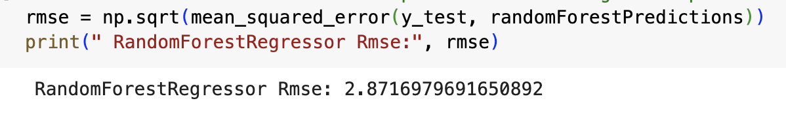
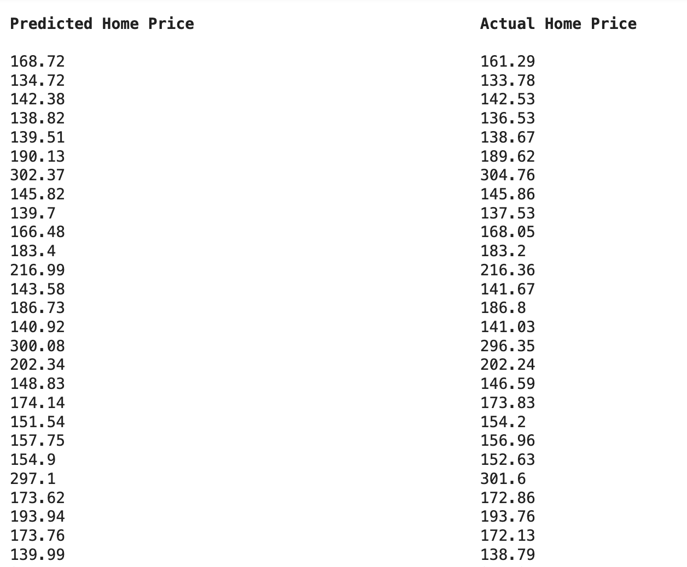

# Data Science Final Project Report

### Team: CodeCrusaders
### Created on: Feb 23, 2023
### Created by: Sukhdeep Kaur, Robin Hurtado, Raayan Mamoon

## Introduction
The goal of this project is to predict home prices by using the randomForest regressor with target values like constant price index, GDP, housing subsidies, and so on. As such, we are using a Python Notebook file to analyze the data and make predictions about them. Our hypothesis is that delinquency and unemployment rates are the strongest predictors in determining the prices of homes.

## Selection of Data
We obtained our dataset from Kaggle [here](https://www.kaggle.com/datasets/jyotsnagurjar/factors-influencing-us-house-prices).  

The dataset consists of 16 numeric features affecting house prices in the United States. (should we list them all?) The data was already cleaned and tidy. It consists of 240 complete samples. There are no missing or null values.  

The only data that was not numeric was the Date feature, which was a Date/Time object.  We converted this to integer format to make it easier to use in visualizations and Machine Learning.    

## Methods:
**Tools:**
- Numpy, Pandas, Matplotlib, and Seaborn for data exploration and visualization
- Scikit-learn for prediction
- Github for file hosting and version control
- Google Collab for code collaboration
  
**Machine learning techniques for this project:**
- Models:
   - Decision Tree,
 - KNeighborsRegressor
 - RandomForestRegressor
   *to analyze performance and use the most accurate to predict the home prices.*
 
- Features:
 - Polynomial Features: used the polynomial feature to display the non-linear connection between features and actual target home price values.
 - Root Mean Squared Error (RMSE): Calculated RMSE of all three models (Decision Tree, KNeighborsRegressor, RandomForestRegressor) to find out the performance and accuracy. 
 - Mean Absolute Error (MAE): Calculated MAE to find the total average difference between predicted home values and dataset home values.
 - Cross-validation: Calculated cross-validation to assess the performance of RandomForestRegressor model
 - Feature Importances: Calculator feature importances to investigate what features have more impact on target values.
-Plotting:
 - Pair plot: Displayed pair plot to show how the features related specifically to the planned target variable
 - Correlation Matrix Heat map: Created correlation Matrix heat map to visualize which variables have the strongest relation
 - Bar plot: Created a bar plot specifically for the Decision Tree implementation tree to predict home prices. Plot showing the feature importances.
 - Scatter plot: Displayed a scatter plot to compare actual home prices with predicted home prices

## Results:
Upon implementing KNN Regression, Random Forest and Decision tree algorithms, we found that the most efficient one would be Random Forest as it has the RMSE of 2.87. 

Below are the results of RMSE calculations of all three:

K-Nearest Neighbors (KNN) 

Decision Tree:

Random Forest:

## Discussion:

As you can see Random Forest Regressor has the lowest RMSE, we executed further evaluation by calculating MAE, Cross-validation, and Polynomial Features. It is most efficient to predict the home prices in our dataset. We evaluated each machine learning model before calculating home price prediction. The goal is to pick the best model and predict home prices.

Finally, the random forest model to effectively calculate predicted home prices. We printed the output in a proper format so it is easy to compare with actual home prices present in our dataset. 

Here is the visual representation of predicted home prices vs actual home prices:

## Summary:
In short, we collected the US Home Price dataset from Kaggle, reading thoroughly, ensuring the cleanliness and organization of the columns and rows. Showcasing the clean data at the beginning, creating helpful plots to learn more about the details of our data. We then implemented three regression models: KNN, random forest, and decision tree, analyzed their performance by calculating the Root Mean Squared Error. We moved forward with random forest to predict home prices. Lastly, we finally presented the result of predicted home prices and compared them with the actual home prices given in the dataset with the most efficient model. 
